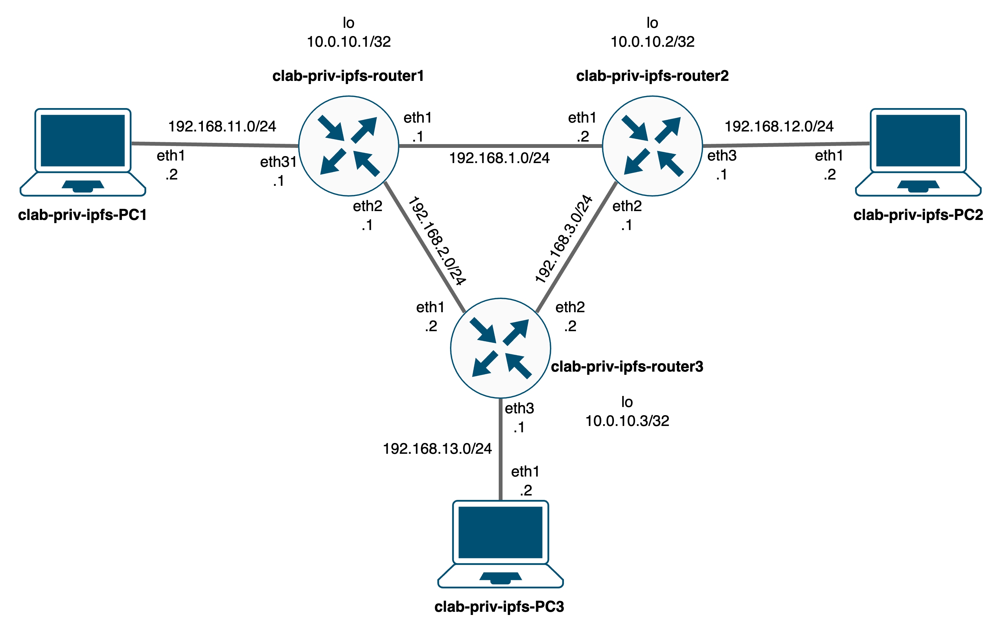

# priv-ipfs

## Overview
This repository provides a Containerlab project for setting up a private IPFS network.
The network consists of 3 IPFS nodes and 3 routers.



## Deployment
### 1. Clone the repository
```bash
git clone https://hydrokhoos/priv-ipfs.git
cd priv-ipfs
```

### 2. Generate swarm key to make IPFS private
> **Note**: [Go](https://go.dev/doc/install "Go installation") needs to be installed first.
```bash
go install github.com/Kubuxu/go-ipfs-swarm-key-gen/ipfs-swarm-key-gen@latest
mkdir PC
touch PC/swarm.key
ipfs-swarm-key-gen > ./PC/swarm.key
# If you encounter an issue:
$(go env GOPATH)/bin/ipfs-swarm-key-gen > ./PC/swarm.key
```

### 3. Deploy containers using Containerlab
> **Note**: Ensure you have [Containerlab](https://containerlab.dev/install/ "containerlab installation") installed.
```bash
docker build -t ipfs-test .
sudo clab deploy -t priv-ipfs.yaml
```

### 4. Start up PCs
```bash
./startupPCs.sh
```

### 5. Check IPFS
```bash
docker exec clab-priv-ipfs-PC1 ipfs swarm peers
# Should return nothing initially.
```

### 6. Add bootstrap nodes
```bash
./addBootstrap.sh
```

```plain text
added /ip4/192.168.12.2/tcp/4001/p2p/12D3KooWLq1iApFjaWd2shtC2rUNNGAhvd5gFKHYEdYMCLLAE2qv
added /ip4/192.168.13.2/tcp/4001/p2p/12D3KooWKRVxsh1JgcxeHW7k7URRoemrfHKYcoZ9qzyTAhdCQwz6
```

### 7. Check IPFS
> **Note**: This step might take a little time.
```bash
docker exec clab-priv-ipfs-PC1 ipfs swarm peers
```

```plain text
/ip4/192.168.12.2/tcp/4001/p2p/12D3KooWLq1iApFjaWd2shtC2rUNNGAhvd5gFKHYEdYMCLLAE2qv
/ip4/192.168.13.2/tcp/4001/p2p/12D3KooWKRVxsh1JgcxeHW7k7URRoemrfHKYcoZ9qzyTAhdCQwz6
```

## Usage 1
### 1. Provide from PC1
```bash
docker exec clab-priv-ipfs-PC1 sh -c 'echo "Hello, world!" | ipfs add'
```

```plain text
14 B / ? added QmeeLUVdiSTTKQqhWqsffYDtNvvvcTfJdotkNyi1KDEJtQ QmeeLUVdiSTTKQqhWqsffYDtNvvvcTfJdotkNyi1KDEJtQ
 ```

### 2. Retrieve from PC3
```bash
docker exec clab-priv-ipfs-PC3 ipfs cat QmeeLUVdiSTTKQqhWqsffYDtNvvvcTfJdotkNyi1KDEJtQ
```

```plain text
Hello, world!
```

## Usage 2
### 1. Adding contents
```bash
docker exec -it clab-priv-ipfs-PC1 bash
./pub_testcontents.sh
```

### 2. Find provider and peer
```bash
docker exec -it clab-priv-ipfs-PC2 bash
./get_testcontents.sh
```

### 3. Check results
Measurement results are saved in ```clab-priv-ipfs-PC2:/ipfs-find-provs-peer.csv```
```bash
docker cp clab-priv-ipfs-PC2:/ipfs-find-provs-peer.csv .
```

## Destroy
```bash
sudo clab destroy -t priv-ipfs.yaml
```
